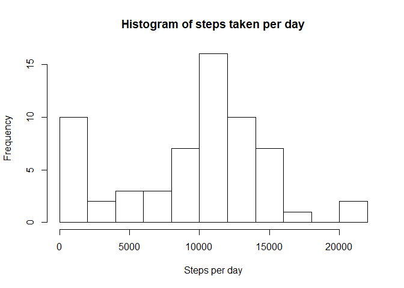
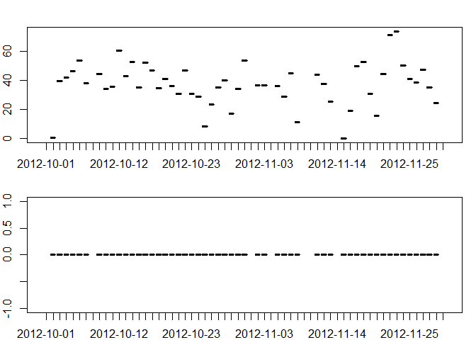
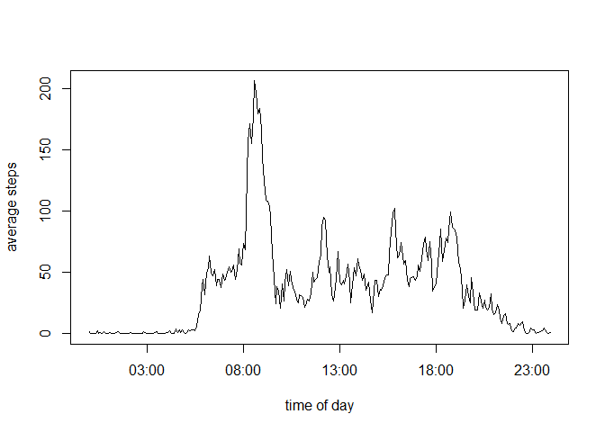
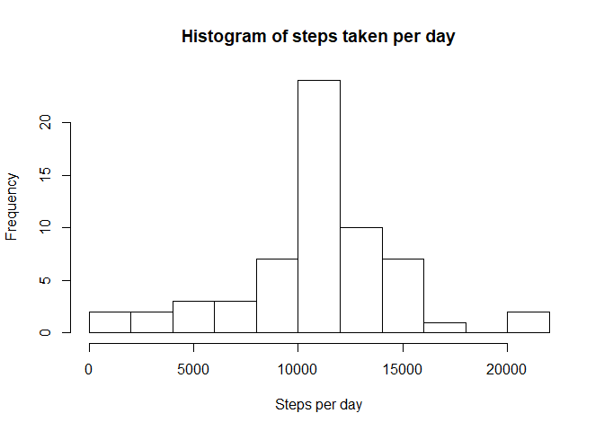
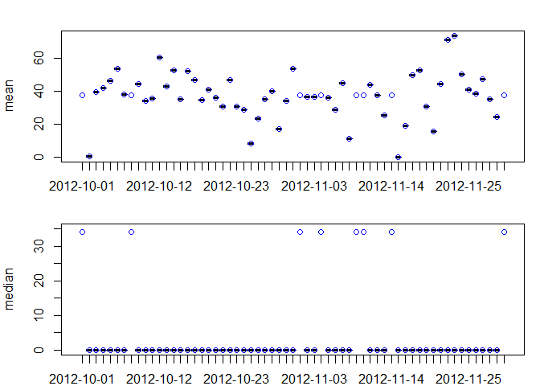

## Loading and preprocessing the data

Convert interval into factor.


```r
library(stringr)
library(dplyr)
```

```
## 
## Attaching package: 'dplyr'
```

```
## The following objects are masked from 'package:stats':
## 
##     filter, lag
```

```
## The following objects are masked from 'package:base':
## 
##     intersect, setdiff, setequal, union
```

```r
library(ggplot2)

activity <- read.csv(unzip("activity.zip"), na.strings = "NA")
activity$interval <- as.factor(activity$interval)
```


## What is mean total number of steps taken per day?

Sum the number of steps per in variable daysum and plot an histogram of the steps taken per day.

```r
daysum <- activity %>% group_by(date) %>% summarise(sum = sum(steps, na.rm = TRUE))
hist(daysum$sum, breaks = 10, main = "Histogram of steps taken per day", xlab = "Steps per day")
```

<!-- -->

Mean and median of steps taken per day:

```r
daystats <- activity %>% group_by(date) %>% summarise(mean = mean(steps, na.rm = TRUE), median = median(steps, na.rm = TRUE))

par(mfrow = c(2,1), mar = c(2, 2, 2, 1))
with (daystats, {
    plot(date, mean, ylab = "mean")
    plot(date, median, ylab = "median")
    })
```

<!-- -->


## What is the average daily activity pattern?

First group 5 minute intervals over days and calculate mean
Then create extra time variable as x axis for timeseries plot 

```r
avday <- activity %>% group_by(interval) %>% summarise(steps = mean(steps, na.rm = TRUE))

avday$time <- str_pad(as.character(avday$interval), 4, pad = "0") 
avday$time <- strptime(avday$time, format = "%H%M")
plot(avday$time, avday$steps, type = "l", xlab = "time of day", ylab = "average steps")
```

<!-- -->


```r
timeofmax <- avday[which.max(avday$steps),]$time
timeofmax <- format(timeofmax, format = "%H:%M")
```

The interval with the most steps on a day on average is at 08:35

## Imputing missing values


```r
miscount <- sum(is.na(activity$steps))
```
The total number of rows with missing values is: 2304

Function to fill the missing values with the mean of the 5-minute interval

```r
fillact <- function (activity, daymean)
{
    # get indices of NA's
    mis_ind <- which(is.na(activity$steps))
    
    for (i in seq_along(mis_ind))
    {
        # for each NA get steps from same interval of daymean
        ind <- which(daymean$interval == activity[mis_ind[i], ]$interval)
        activity[mis_ind[i],]$steps <- daymean[ind,]$steps
    }
    
    activity
}
```

Create new dataset with missign values replaced by mean of 5-minute interval


```r
activity2 <- fillact(activity, avday)
```

recalculate the sum the number of steps per in variable daysum and plot an histogram of the steps taken per day with new dataset without missing values.

```r
daysum2 <- activity2 %>% group_by(date) %>% summarise(sum = sum(steps, na.rm = TRUE))
hist(daysum2$sum, breaks = 10, main = "Histogram of steps taken per day", xlab = "Steps per day")
```

<!-- -->

recalculate Mean and median of steps taken per day with new dataset without missing values:
blue represents values with imputed missing values.
black represents values with missing values

```r
daystats2 <- activity2 %>% group_by(date) %>% summarise(mean = mean(steps, na.rm = TRUE), median = median(steps, na.rm = TRUE))

par(mfrow = c(2,1), mar = c(2, 4, 2, 1))
plot(daystats$date, daystats$mean, ylab = "mean")
points(daystats2$date, daystats2$mean, col = "blue")
plot(daystats$date, daystats$median, ylim = c(0, 35), ylab = "median")
points(daystats2$date, daystats2$median, col = "blue")
```

<!-- -->

The most visible difference between the histogram with missing values and the one without missing values is the decrease of number of days fallign in the lowest category.
The means of the days did not change by imputing the missing values, only a mean can now be calculated of days without mean before.
The median stays zero after imputing the missing values. The median of the missing days is not zero, because the mean is used for imputing the missing values.

## Are there differences in activity patterns between weekdays and weekends?

plot average activity for weekdays and for weekend days

```r
# Add extra factor variable daytype indicating of day is a weekday or in a weekend.
activity2_date <- strptime(as.character(activity2$date), format = "%Y-%m-%d")
activity2_weekday <- weekdays(activity2_date, abbreviate = TRUE)

for (i in seq_along(activity2_weekday))
{
    # indicate of day is a weekday or in a weekend
    if (activity2_weekday[i] == "za" || activity2_weekday[i] == "zo")
    {
        activity2$daytype[i] <- "weekend"
    }
    else
    {
        activity2$daytype[i] <- "weekday"
    }
}
activity2$daytype <- as.factor(activity2$daytype)

# calculate mean of intervals on weekdays and weekend days
avdaytype <- activity2 %>% group_by(interval, daytype) %>% summarise(steps = mean(steps))

#plot the average week- and weekendday
qplot(as.integer(as.character(interval)), steps, data = avdaytype, geom = "line", group = daytype, facets = daytype~., xlab = "interval")
```

<!-- -->

On an average weekend day, the activity starts later and continues till later. Also the activity peak is lower on a weekend day.
